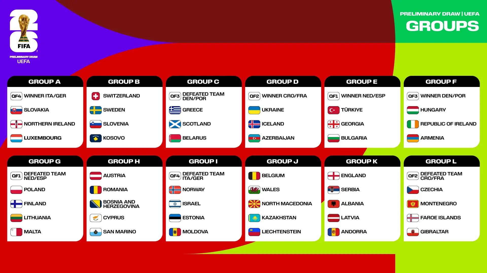

# Who is going to qualify for the World Cup 2026

🚧🚧🚧 This project is under active development. Stay tuned for updates! 🚧🚧🚧

## What?

The UEFA World Cup qualification tournament is starting soon in March 2025, and this project aims to predict its outcome! Which teams will secure a spot at the 2026 FIFA World Cup held in Canada, Mexico, and the United States? Will Finland qualify for the first time? What are the chances that a football powerhouse might miss out? 

## How?

To predict the outcomes of UEFA qualification matches, this project employs a predictive model that takes into account:
- Historical match performance
- Team form and recent results
- Additional key features such as rankings and match conditions

The model will simulate the entire qualification tournament multiple times to estimate each team’s chances of qualifying for the World Cup.

## Why?

Football predictions offer a fascinating way to combine sports analytics, machine learning, and data science. This project aims to provide insights into:
- The likelihood of different teams qualifying
- Possible surprises or upsets during the qualification stage
- Statistical chances of individual qualifications

## Data Sources

The following datasets are used to train the predictive model:

- [International Football Results from 1872 to 2024](https://www.kaggle.com/datasets/martj42/international-football-results-from-1872-to-2017/)  
  This dataset contains results for international matches spanning more than 150 years.

- [FIFA World Ranking 1992-2024](https://www.kaggle.com/datasets/cashncarry/fifaworldranking)  
  Historical FIFA rankings for national teams from 1992 to 2024.

## Roadmap
- [x] Data collection and preprocessing
- [x] Exploratory data analysis (EDA)
- [ ] Model selection and training
- [ ] Tournament simulations
- [ ] Visualization of results

## Installation
Dependencies:
- numpy
- pandas
- scipy
- matplotlib
- seaborn
- scikit-learn
- ipython